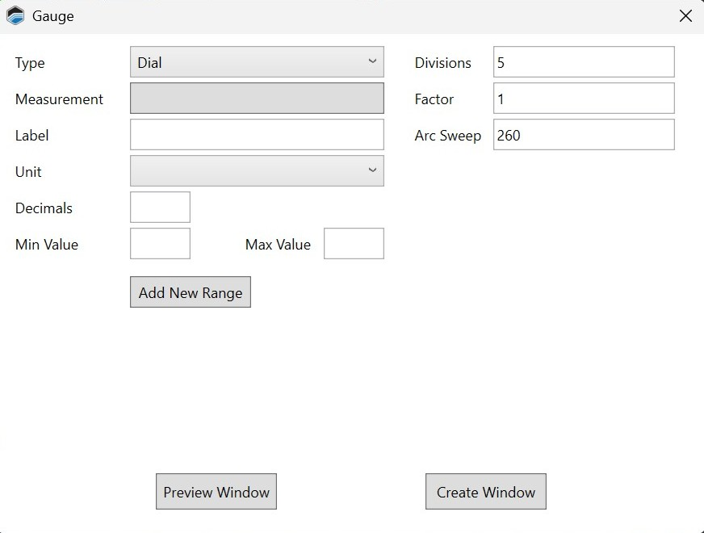
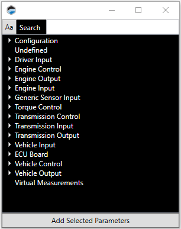

# ADDING A GAUGE

A gauge can be created to display value of any numerical stream of data provided by the ECU.

1. In the menu bar, select **Layout** > **Add Control** > **Add Measurement**. A list of gauge types appears.

2. Select the type of gauge to add: Dial Gauge, Bar Gauge or Value Gauge. A window showing the properties for the new gauge appears.

>**NOTE:** The configurable properties in this window vary by type of gauge.

3. Click the **Measurement** box. A list of signals appears.

4. Select the signal whose value you want the gauge to display.

5. Click **Add Selected Parameters**.

6. Configure the remaining parameters for the gauge.

7. 	Click **Create Window**.

<a href="#" class="top-button" title="Return to top">↑</a>