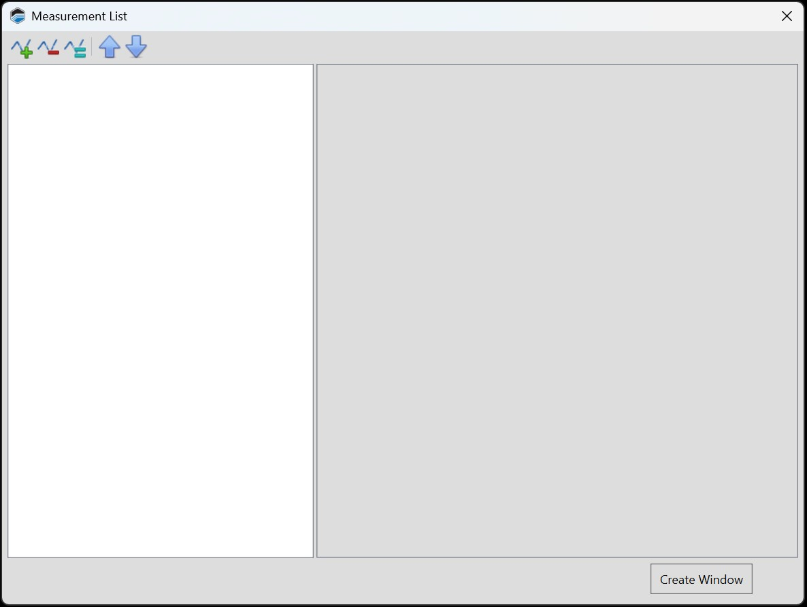
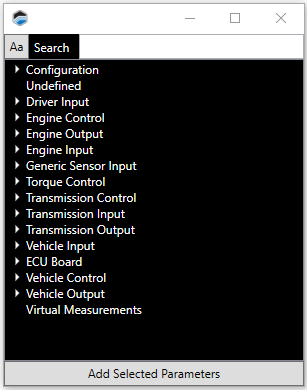
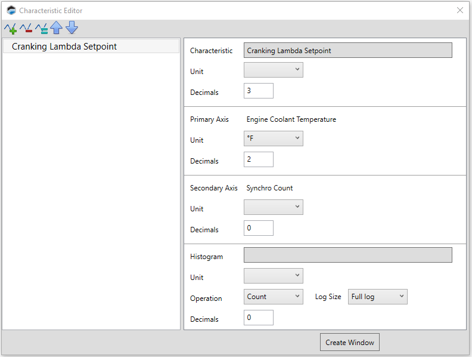

# ADDING A TABLE EDITOR

Editors are subwindows that contain configuration interfaces for one or more of the ECU's tunable tables.

1. In the menu bar, select **Layout** > **Add Control** > **Add Characteristic** > **Add Editor**. The below window will appear.

2. Click  icon and the below window will appear, search for your desired Characteristic (s).

3. Double-click on the table you wish to add. The right column will now show three or four different groups of parameters.

    From top to bottom:
    
    - The top group includes the table title and the format for the cell data.

    - The second group configures the horizontal axis.

    - For two dimensional tables only, the third group configures the vertical axis.

    - The last group can be used to add a histogram display to the new table. To do this, click the Histogram field and then select the measurement that will be used to to populate the histogram data.

4. Configure the parameters displayed.

5. If you wish to add a table to this subwindow,

    a. Repeat steps 2 through 4 for the new table.
    >**NOTE:** When multiple tables are added to the same subwindow, they will be displayed as tabs across the top of the subwindow. A table can be selected by clicking its tab. If there are too many tabs to fit across the top of the subwindow, the first tab becomes a dropdown menu that you can use for table selection.

6. When all the tables that you want to include in this subwindow have been added and configured, click Create Window.

## Toolbar

| Icon | Description |
| ----------- | ----------- |
|  | Add a new measurement to the list. To complete signal setup, you must configure the signal's parameters.|
|  | Delete the measurement selected in the left column. |
|  | Duplicate the signal measurement selected in the column on the left. |
|  | Move the table selected in the left column upwards in the list. This changes the order of the tabs at the top of the subwindow.|
|  | Move the table selected in the left column downwards in the list. This changes the order of the tabs at the top of the subwindow. |

<a href="#" class="top-button" title="Return to top">↑</a>