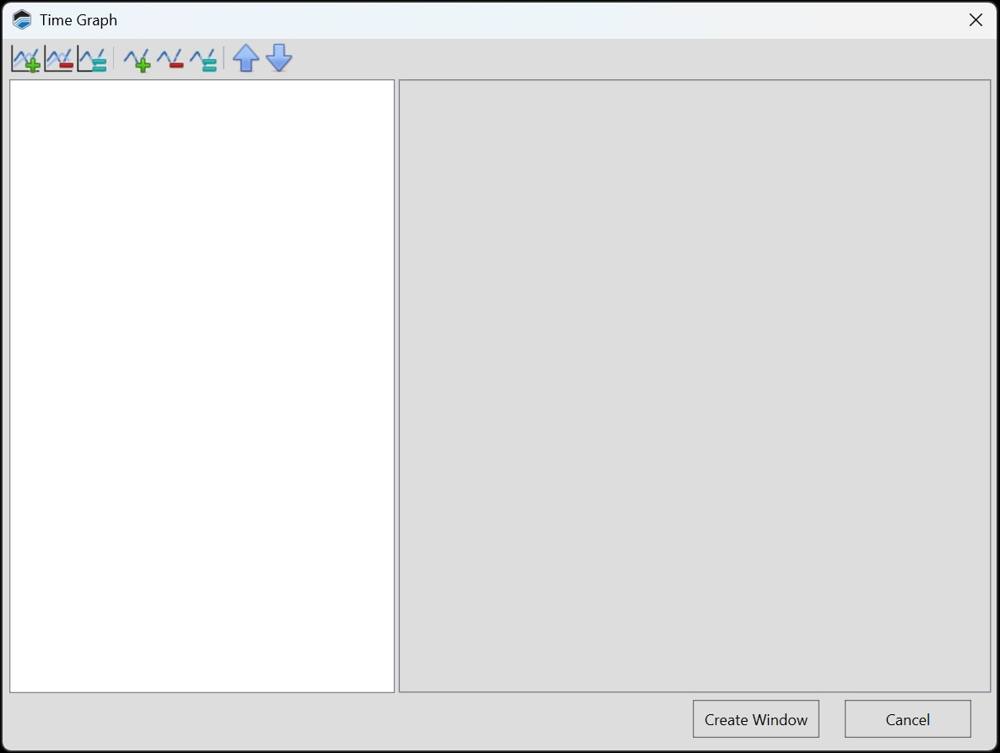
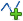
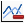
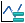

# ADDING A TIME GRAPH

A time graph displays line charts of one or more signals over time. When scanning an ECU, the charts are drawn in real time. During playback of a log file, they display a time window surrounding the current time index of the playback.

To add a time graph:

1. In the menu bar, select **Layout** > **Add Control** > **Add Measurement** > **Add Time Graph**. The below window will appear, create your desired group (s) with which ever measurements you desire, utilize the below **Adding a Group** & **Adding a Signal (Measurement) to a Group** instructions to do so.

    

2. When configuration is complete, Click **Create Window**.

## Adding a Group

1. Click .

2. Add the desired signals to the group using the instructions below.

## Adding a Signal (Measurement) to a Group

1. Click on the desired group you intend to add a measurement too.

2. Click .

3. Search for the measurement you wish to add.

4. Double-click on the measurement whose output you want to display.

5. Complete signal setup by configuring the signal's [parameters](Time Graph Parameters.md).

## Editing an Existing Signal (Series)

To configure a signal that is already included in this layout:

1. Select the name of the signal in the column on the left.

2. Modify the signal [parameters](Time Graph Parameters.md) displayed on the right.

## Toolbar

| Icon | Description |
| ----------- | ----------- |
|  | Add a new (empty) chart group. To complete group setup, add the signals (series) that would be included in the group.|
|  | Delete the chart group selected in the left column. |
|  | Duplicate the group selected in the left column. |
|  | Add a new signal (series) to the group selected in the column on the left. To complete signal setup, you must configure the signal's [parameters](Time Graph Parameters.md).|
|  | Delete the signal (measurement) selected in the left column.|
| | Duplicate the signal (measurement) selected in the column on the left.|
| | Move the signal selected in the left column upwards in the list. |
| | Move the signal selected in the left column downwards in the list. |

<a href="#" class="top-button" title="Return to top">↑</a>