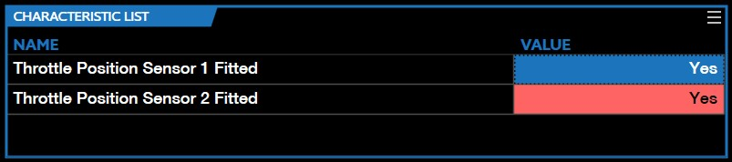
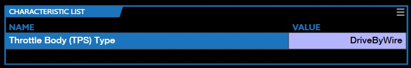
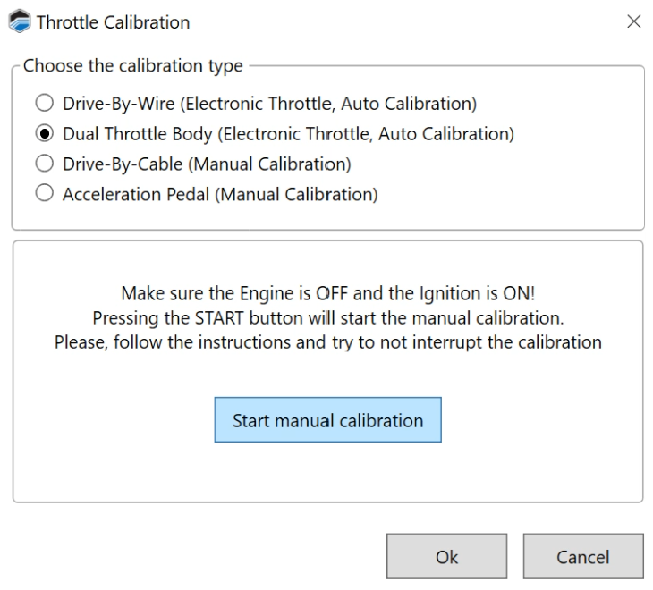
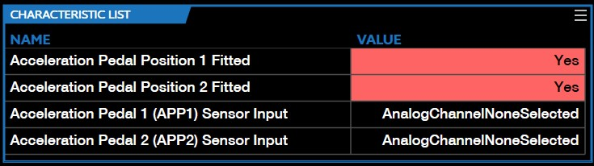
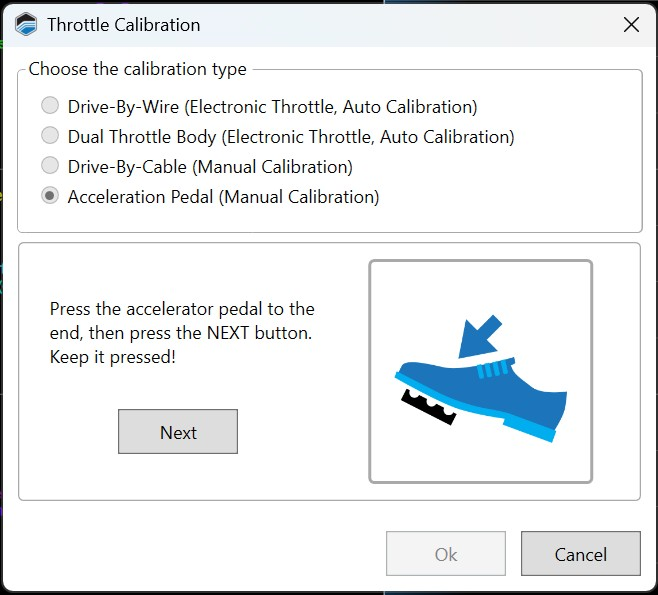

# AUTOMATIC THROTTLE CALIBRATION

The Automatic Throttle Calibration wizard can be used to calibrate the following:

- Single body electronic (Drive by wire) throttles

- Dual body electronic (Drive by wire) throttles

- Manual (Drive by cable) throttles

- The acceleration pedal

## Single & Dual Body Electronic Throttles

**Before you begin**

Ensure that both throttle position sensors are "fitted". For single body throttles, both sensors must be fitted to the throttle body. For dual body throttles, TPS 1 must be fitted to the primary throttle body and TPS 2 must be fitted to the secondary throttle body. Moreover, the electronic throttle actuator outputs must be assigned correctly:

- **Throttle Position Sensor 1 Fitted**. Set to YES

- **Throttle Position Sensor 2 Fitted**. Set to YES

- **Throttle Position 1 (TPS 1) Sensor Input**. Set to the correct analog input for TPS 1.

- **Throttle Position 2 (TPS 2) Sensor Input**. Set to the correct analog input for TPS 2.

- **Electronic Throttle Actuator Output**. Set to the correct H-bridge for the primary throttle body's actuator.

- **Electronic Throttle Actuator 2 Output**. Required only for dual throttle body setups. In such setups, it must be set to the correct H-bridge for the secondary throttle body's actuator. For single throttle body setups, this can be used for an optional secondary actuator for the throttle.

### Drive-By-Wire Automatic Calibration Procedure

1. Place the ignition in Key On Engine Off state.

2. Ensure the engine is NOT running.

3. Ensure all "*Throttle Position Sensor 1 & 2 Fitted*" parameter characteristics are set to "*Yes*".

4. Ensure both "*Throttle Position 1 Sensor (TPS 1) Input*" & "*Throttle Position 2 Sensor (TPS 2) Input*" are connected to the correct "*AnalogChannel*" on the ECU side.

5. Ensure both "*Electronic Throttle Actuator Output*" & "*Electronic Throttle Actuator 2 Output*" are assigned to the correct pin HBridges.

6. Ensure the "*Throttle Body (TPS) Type*" is set to "*DriveByWire*".

7. In the menu bar, select **ECU > Automatic Throttle Calibration**.

8. If calibrating a single body throttle, select Drive-By-Wire.

9. Click Start auto calibration. VCM Live will begin testing the throttle, placing in various states (Full Open, Full Closed, At Rest).

10. Once it is completed, the wizard will display "*DONE!*" indicated the auto calibration is complete, then select **Ok**.

11. In the menu bar select **Tune** then **Save Tune As** to write/migrate the data.

12. Click  The Vehicle Writing window will appear and within the "*Operation confirmation window*" select **YES**.

13. The Drive-By-Wire Automatic Calibration is now complete.

### Dual Throttle Body Automatic Calibration Procedure

1. Place the ignition in Key On Engine Off state.

2. Ensure the engine is NOT running.

3. 	Ensure all "*Throttle Position Sensor 1 & 2 Fitted*" parameter characteristics are set to "*Yes*".

4. Ensure both "*Throttle Position 1 Sensor (TPS 1) Input*" & "*Throttle Position 2 Sensor (TPS 2) Input*" are connected to the correct "*AnalogChannel*" on the ECU side.
> **NOTE:** Dual throttle body will have four inputs but not all four inputs need to be connected to perform the calibration.

    

5. Ensure both "Electronic Throttle Actuator Output" & "Electronic Throttle Actuator 2 Output" are assigned to the correct pin HBridges.

6. Ensure the "Throttle Body (TPS) Type" is set to "DualThrottleBody".

7. In the menu bar, select **ECU** > **Automatic Throttle Calibration**. The throttle calibration window appears.

8. Select **Dual Throttle Body**.

9. Click **Start auto calibration**. VCM Live will begin testing the throttle, placing in various states (Full Open, Full Closed, At Rest).

10. Once it is completed, the wizard will display "DONE!" indicated the auto calibration is complete, then select "*Ok*".

11. In the menu bar select "Tune" then "Save Tune As" to write/migrate the data.

12. Click . The Vehicle Writing window will appear and within the "Operation confirmation" window select "*YES*".

13. The Dual Throttle Body Automatic Calibration is now complete.

### Drive-By-Cable (Manual) Calibration Procedure

1. Place the ignition in Key On Engine Off state.

2. Ensure the engine is NOT running.

3. Ensure all "*Throttle Position Sensor 1 & 2 Fitted*" parameter characteristics are set to "*Yes*".

4. Ensure both "*Throttle Position 1 Sensor (TPS 1) Input*" & "*Throttle Position 2 Sensor (TPS 2) Input*" are connected to the correct "*AnalogChannel*" on the ECU side.

5. Ensure the "Throttle Body (TPS) Type" is set to "DriveByCable".

6. In the menu bar, select **ECU** > **Automatic Throttle Calibration**. The Throttle Calibration window appears.

7. Select **Drive-By-Cable**.

8. Click **Start auto calibration**. VCM Live will begin testing the throttle, placing in various states (Full Open, Full Closed, At Rest).

9. Once it is completed, the wizard will display "DONE!" indicated the auto calibration is complete, then select "*Ok*".

10. In the menu bar select "*Tune*" then "*Save Tune As*" to write/migrate the data.

11. Click . The Vehicle Writing window will appear and within the "Operation confirmation" window select "*YES*".

12. The Drive-By-Cable Automatic Calibration is now complete.
>**NOTE:** Users can utilize the speedometer gauge on their dash to follow along during the Drive-By-Cable calibration. Fully open will cause the speedometer needle to go to the gauges top MPH, fully closed will cause the speedometer needle to go to the 0 MPH.

### Acceleration Pedal (Manual) Calibration Procedure

1. Place the ignition in Key On Engine Off state.

2. Ensure the engine is NOT running.

3. Ensure both "*Acceleration Pedal 1 (Accel Pedal 1) Sensor Input*" & "*Acceleration Pedal 2 (Accel Pedal 2) Sensor Input*" parameter characeristics are connected to the correct "AnalogChannel" on the ECU side.

4. Ensure both "*Acceleration Pedal Position 1 Fitted*" & "*Acceleration Pedal Position 2 Fitted*" are set to "*Yes*".

5. In the menu bar, select **ECU** > **Automatic Throttle Calibration**. The Throttle Calibration window appears.

6. Click **Acceleration Pedal (Manual Calibration)** and then click **Start manual calibration**.
.png)

7. VCM Live will prompt you to press down on the acceleration pedal, once pedal is all the way down, click "*Next*".

8. Lift your foot completely off the pedal once VCM Lives prompts you to do so and click "*Next*".

9. Once it is completed, the wizard will display "DONE!" indicated the auto calibration is complete, then select "*Ok*".

10. Click . The Vehicle Writing window will appear and within the "Operation confirmation" window select "*YES*".

11. VCM Live will begin writing to the vehicle, once it's completed, in the menu bar select "*Tune*" then "*Save Tune As*" to write/migrate the data.

12. The Acceleration Pedal Calibration is now complete.
>**NOTE:** If any of the above calibrations returns an error message, ensure to DEBUG by checking all wire connections, inputs assignments, and if all sensors are fitted correctly.

<a href="#" class="top-button" title="Return to top">↑</a>