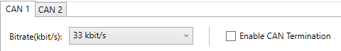
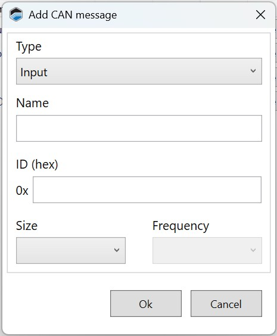
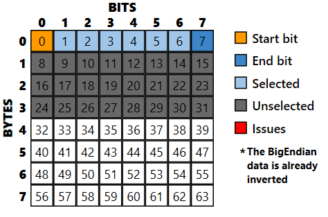

# CAN BUS CONFIGURATION

There are four different CAN bus configuration tasks that can be performed in this window:

1. Set the bit rate for the CAN bus.

2. Enable or disable CAN bus termination.

3. Define signals (measurements) that should be sent to devices on the CAN bus.

4. Identify each type of message that may be received from the CAN bus.

To open this window, select **ECU** > **CAN Config** in the menu bar.
>**NOTE:** The Predefined button is solely for configuring a TurboLamik TCM.

## Setting The Can Bus Bit Rate

The **Bitrate** dropdown at the top of the top of the window is used to set the bitrate of the CAN bus. All devices on the bus must use the same bitrate.

## CAN Bus Termination

A CAN bus must have exactly two termination resistors, one at each end. If you wish to use the ECU as one of the endpoints:

1. Check the **Enable CAN Termination** box.

2. Ensure that there is one (and only one) other termination resistor on the bus.
>**NOTE:** If you already have two termination resistors on the CAN bus, uncheck the Enable CAN Termination box. This allows the ECU to act as a node in the middle of the network.

## Sending Data To Devices On The CAN Bus

It's possible to send any ECU measurement to any other device on the CAN bus. Follow these steps for each parameter that needs to be transmitted:

1. Click the **Add** button in the CAN Messages group. The Add CAN Message window appears.

2. Fill out the fields in this window as follows:

    - **ID (hex)**: The numerical ID of the message. This must be unique on the CAN network and also represents message priority (lower numbers are higher priority).

    - **Name**: A descriptive name for the message.

    - **Type**: For sent messages, this should be set to Output.

    - **Length**: The number of bytes in this message.

    - **Frequency**: The number of times per second that this message should be sent.

3. Click **Ok**.

4. The new message will now be listed in the CAN Messages group. Select the new message in the list (click on it).

5. Add the measurements that will be sent in this message. For each measurement to be added:

    a. Click **Add** in the Measurements group. A list of available measurements appears.
    

    b. Double click on the measurement you want to add. The selected measurement will now appear in the Measurements List.

    c. Configure the format of this measurement within the message. See **Measurement Format**.

## Receiving Messages From the CAN Bus

Messages from the CAN bus can be mapped to any one of a number of predefined inputs. Follow these steps:

1. Click the **Add** button in the CAN Messages group. The Add CAN Message window appears.

2. Fill out the fields in this window as follows:
    - **ID (hex)**: The numerical ID of the message. This must be unique on the CAN network and also represents message priority (lower numbers are higher priority).

    - **Name**: A descriptive name for the message.

    - **Type**: For received messages, this should normally be set to Input. However, if you're configuring a CAN-based lambda sensor, selecting Lambda Input will simplify the CAN configuration for that sensor (you will be able to choose a predefined configuration, based on sensor manufacturer).

    - **Length**: The number of bytes in this message. (Not available for lambda inputs).

    - **Frequency**: The number of times per second that this message should be sent. (Not available for Lambda Inputs).

3. Click **Ok**.

4. The new message will now be listed in the CAN Messages group. Select the new message in the list (click on it).

5. Specify the inputs to which this message will be mapped. For each input to map:

    a. Click **Add** in the Measurements group. A list of available inputs appears.
    

    b. Double click on the input you wish to use. The selected input will now appear in the Measurements List.

    c. Configure the data format for this input. For Lambda Sensor bank 1 and bank 2, simply select the lambda sensor type in the Measurements List. For all other measurements, see *Measurement Format*, below.

## Measurement Format

There are a number of settings that format each item in the Measurements list.

As you configure these settings, you can see the bit format you are configuring in the lower left corner of the window.

The blue and orange bits represent the row you have selected in the measurement list on the right side of the window.

If bits are red, it means there is some problem with the configuration. For example, if you indicate that your first measurement takes up 11 bits, but your second measurement starts on bit 8, the data would overlap.

### Start Bit

The bit of the message that this measurement starts on. For example, if the first measurement in the message starts on bit 0 and is 8 bits wide, it will take up bits 0 to 7. So, the second measurement would likely start on bit 8.

### Width

The number of bits used to encode the value of this measurement.

### Byte Order

Indicates whether the most significant bit is the first bit or the last bit of this measurement.

- **Intel** - The most significant bit is stored last (little endian). This is typically the case with Intel processors.

- **Motorola** - This most significant bit is stored first (big endian). This is typically the case with Motorola processors.

### Type

- **Signed** - The value indicates whether it is positive or negative.

- **Unsigned** - The value contains only positive numbers.

### Gain and Offset

CAN messages use these values to optimize the way data is encoded.

When sending a message (output messages), the value actually encoded for the measurement is equal to:

- (Measurement - Offset) / Gain

When receiving messages (input messages), the value to be used is calculated by applying the following formula to the received value:

- (Received value * Gain) + Offset

### MIN

The minimum allowed value for this parameter.
>**NOTE:** Clicking **Calculate Min and Max** tells VCM Live calculate these values automatically based on the other configuration in this row.

### MAX

The maximum allowed value for this parameter.

>**NOTE:** CORE will only support the Motec LTC CAN Lambda monitor.

1. On the menu bar select **ECU** > **CAN Config**, the CAN Config window will appear.

2. Select **Add** and the Add CAN Window will appear.

3. Fill out the fields with the corresponding values from Motec LTC module monitors, refer to Motec's specifications documentation.

4. Select **Ok**.

5. Ensure to select the correct **Bitrate(kbit/s")**.

    > **NOTE:**

    >- The "DLC" & "Frequency" fields will not be used for CAN Lambda.
    > - If you selected the Lambda Input type, there will be only 2 choices listed: Lambda Sensor bank 1 and Lambda Sensor bank 2.
    > - Each Lambda Sensor Bank is required a separate message and is allowed a maximum of 2 lambda messages per CONFIG.

6. Change the **Lambda Bank #1 Sensor Type** paramater value to **Motec_CAN**.

7. Select **Write to ECU**.

8. CAN Lambda configuration is now complete.

<a href="#" class="top-button" title="Return to top">↑</a>