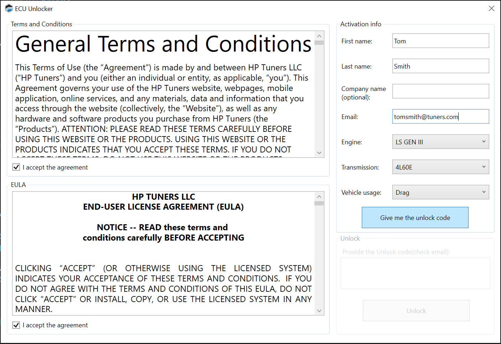

# CONNECTING TO A NEW ECU

1. It is recommended you have the following before you connect to a new ECU:
    - An HP Tuners CORE series ECU that has been installed in the desired vehicle. See the [CORE Installation Guide](https://files.hptuners.com/help/COREInstallGuide.pdf)

    - An account on [HPTuners.com](https://www.hptuners.com/)
    - A computer with VCM Live installed. The computer must have an Ethernet interface
    - An Ethernet cable long enough to connect the computer to the ECU
    - A connection to the internet is required for product activation and registration

2. Connect to the vehicle:

    a. Using an Ethernet cable, connect your computer to the ECU.

    b. Turn the vehicle ignition to a position that represents key ON, engine OFF. (The vehicle must supply power to the ECU. But, a new ECU will not have a tune, so it shouldn't actually run the vehicle.)

    c. Open VCM Live.

    d. Click the  icon in the toolbar to open a data connection to the ECU

    >    **NOTE:**
    >    For additional ethernet connection details, see the [CORE Installation Guide](https://www.hptuners.com/documentation/files/CORE-ECU/Install-Guide/Content/) 

3. The first time you connect to the ECU, you will be prompted to register it.

    

    The registration form must be completed and submitted in order to unlock the ECU for tuning:

    a. Check both of the boxes labeled **I accept the agreement**

    b. Fill out the fields in the **Activation info** box

    c. Click **Give Me the Unlock Code**

    d. An email containing an activation key will be sent to the e-mail address you entered. Enter this code in the box at the bottom of the window

    e. Click **Unlock**

4. When connecting to a new ECU, you will need to load an initial tune into the ECU. This is the base configuration from which you will work. To load a base configuration:

    a. Click the  icon

    b. Navigate to **Documents\HP Tuners\VCM Live\Tunes**

    c. Select a base configuration file that is appropriate to the engine and transmission that will be used with the ECU

    d. Click **Open**. This will load the selected configuration into VCM Live

    e. Click the  icon. The vehicle writing window will appear

    f. In the Operations box, select **Write Entire**

    >    **NOTE:**
    >    **Write Entire** will include writing CAN config files because it is saved within the tune file. Select below g-i steps accordingly

    g. Select the **Tune** check box if you wish to change the tune file while writing to the vehicle

    h. Under the CAN Config (Ready): select either **Write** or **Clear on ECU** to either change the CAN Config file or clear it from the ECU while writing to the vehicle

    i. Under the Standalone Logging Config (Not ready): select either Write or Clear on ECU to either change the standalone logging config file or clear it from the ECU while writing to the vehicle

    j. Click **Write**. A prompt will appear, asking you to confirm that you wish to perform a write entire operation

    k. Click **YES** to confirm

<a href="#" class="top-button" title="Return to top">↑</a>