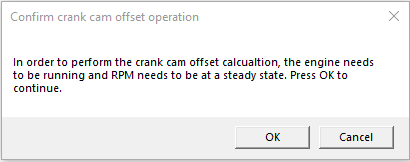

# CRANK CAM OFFSET WIZARD

The crank cam offset wizard can be used to determine the correct crank cam offset to use and will adjust the crank cam offset parameter according to it's findings.
> **NOTE:** This is part of the process needed to sync a cam with a crankshaft that has no missing teeth.

1. Add the measurement named **Calculated Crank Cam Offset** to your current layout.

2. Connect to the ECU.

3. Ensure that the engine is running at a steady RPM.

4. 	In the menu bar, select **ECU > Crank Cam Offset Wizard**. A prompt window appears.

5. Click **OK**.

6. 	Observe the **Calculated Crank Cam Offset** measurement. It should change to a nonzero value.

7. Enter the calculated value into the **Crank Cam Offset** characteristic.

8. Click   to write the tune to the ECU.