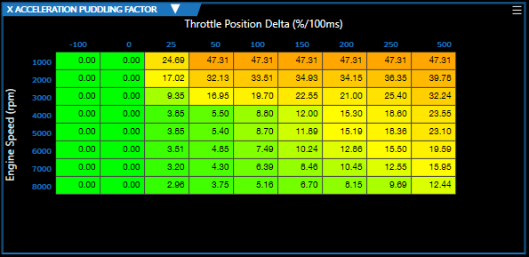

# EDITING TABLES

Editing tables is one of the key tasks required when modifying a tune. A good understanding of the Table Editor's display, layout, and functions will make many tuning tasks much easier.

## Basic Layout

> **NOTE:** Initially, you will see data presented in a normal table view. This is the primary view for editing table data and the majority of the editor's functions are available only in this view.

You can also switch to either a 2D or 3D graph or a histogram view:

| Icon | Description |
| ----------- | ----------- |
|  | **Switch to 3D graph view** - In addition to zooming and rotating the chart, this view allows you to drag click and drag individual data points. See [Using 3D Graph View](Using 3D Graph View.md) for more information.|
|  | **Selects the 2D graph view** - This view allows you to click and drag individual data points. See [Using 2D Graph View](Using 2D Graph View.md). |
|  | **Selects the Histogram view** - This view allows you to view the data from the histogram measurement that has been paired with this table.
|  | **Return to the default table view**.|

> **NOTE:** See [The Table Editor Toolbar](The Table Editor Toolbar.md) for a full list of toolbar functions.

## Editing Cell Data in Tables

Editing cell data has two basic steps:

1. Select the cell(s) you wish to modify.

2. Enter the new cell data or specify how the cell data should be transformed.

> **NOTE**: 

> - The colors of cells whose values have been modified will change. Cells with increased values will appear pink. Cells with decreased values will appear purple.

> - Right-clicking on a cell produces a menu that contains additional options for manipulating cell data. See [Table Editor Right-click Menu](Table Editor Right-Click Menu.md) for more information.

### Selecting Cells

| To Select | Procedure |
| ----------- | ----------- |
| A single cell | Click on the cell.|
| A block of cells, a row or a column | 1. Left click on one corner of the desired block, but do not release the mouse button yet.   2. Drag the mouse pointer to the opposite corner of the desired block.   3. Release the left mouse button.|

### Entering a specific value

To enter a specific value in a selected cell or group of cells, just type the new value.

or

Type the value in the space next to the math symbols in the toolbar and then click the equals sign.

### Adding a Value to Selected Cells

To add a desired value to the selected cell(s):

1. Enter the value to be added in the space next to the math symbols in the toolbar.

2. Click the plus sign.
> **NOTE:**  If you wish to subtract a value rather than add one, enter the desired value as a negative number.

### Multiplying Selected Cells by a Desired Value

To multiply the selected cell(s) by a desired value:

1. Enter the value to multiply by in the space next to the math symbols in the toolbar.

2. Click the multiplication sign.
> **NOTE:**  If you wish to divide by a value rather than multiply, enter the reciprocal of the desired value as a decimal. For example, to divide by two, you would enter 0.5 (the decimal equivalent of 1/2).

### Hot Keys

The following hot keys are available in table view only:

| Hot Key | Description |
| ----------- | ----------- |
| SHIFT +/- | Increment and decrement value(s)|
| CNTRL+C | Copy value(s) |
| CNTRL+V | Paste value(s) |
| CNTRL+Z | Undo last modification |

>**NOTE:** The SHIFT +/- hot key Increments and decrements data from the selected cells for all 1D & 2D tables. It will increment or decrement by 5 or the last considered decimal or the full number if the decimals are not present.

<a href="#" class="top-button" title="Return to top">↑</a>