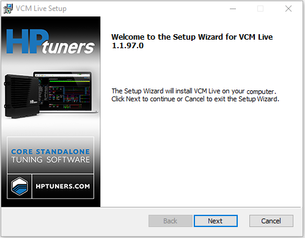

# INSTALLING VCM LIVE

VCM Live is a free download that can be installed on as may computers as you like without additional charges.

## Minimum System Requirements

- Operating System: Windows 10
- CPU: Intel Core i3-6300, 3.8 GHz Quad-Core Processor
- RAM: 8 GB
- An Ethernet port or external Ethernet adapter

NOTE: Ethernet is required for communication with ECUs to be configured.

- An Internet connection is required for certain tasks.

NOTE: Since Ethernet is used to communicate with the ECU, a secondary network access method (such as a second Ethernet port or a WiFi connection) is strongly recommended.

## Installation Instructions

Follow these steps to install the latest version of the VCM Live on your computer:

1. Navigate to [HP Tuners Downloads](https://www.hptuners.com/downloads/)
2. Select the VCM Live download link.
3. Open the download file. The installation wizard will appear.

<!-- break -->

<ol start="4">
  <li>Follow the instructions on screen to complete software installation. </li>
</ol>

<a href="#" class="top-button" title="Return to top">↑</a>