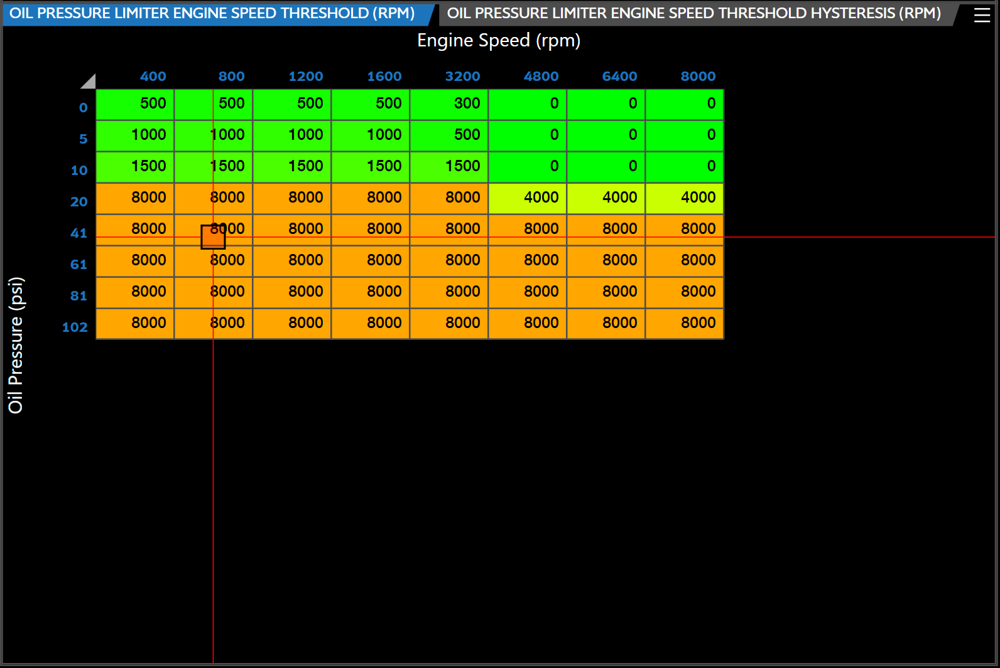

# LIVE TRACING

Live tracing is a valuable feature for monitoring live tuning, providing users with enhanced visual feedback when viewing any 2D or 3D table with VCM Live.

>**NOTE:**

> - In order to utilize live tracing you must first load a log file (See the [Menu Bar](Menu Bar.md) section to load a log file).

> - Live tracing can also be utilized when you begin a recording, while connected to an ECU.

