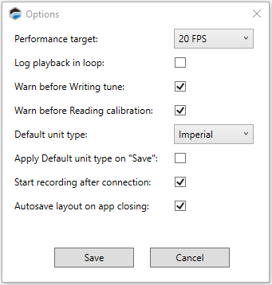
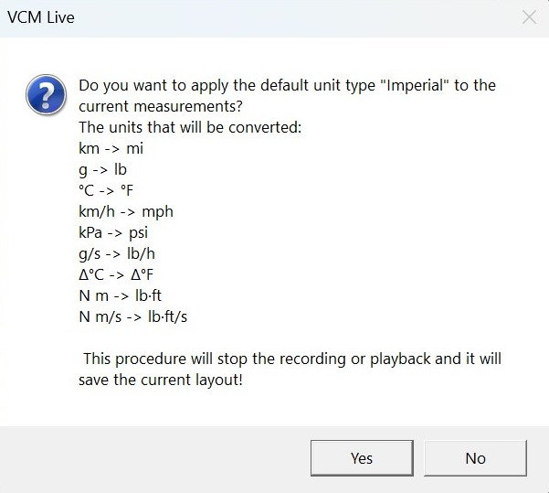

# OPTIONS

The Options window contains various user preference settings for the VCM Live application.
> **NOTE:** Click **Tools** > **Options** in the menu bar to access the options window.

## Performance Target

How often should VCM Live update it's displayed information (in frames per second)? Higher frame rates give better data resolution. Lower frame rates allow more measurements to be tracked simultaneously.

## Log Playback in Loop

Check this box if you want log file playback to restart at the beginning of the file when the end of the file is reached.

## Warn Before Writing Tune

If this box is checked, VCM Live will prompt you to confirm before flashing changes to the ECU.

.png)

> **NOTE:**

>- If this box is NOT checked, no such prompt will appear.
> - Checking the Don't ask gain box removes the check from Warn before writing tune. If you want the prompt to appear again, just check the box here.

## Ask Before Reading Calibration

If this box is checked, VCM Live will prompt you to confirm before attempting to read the connected ECU's current tune.

> **NOTE:** If this box is NOT checked, no such prompt will appear.

## Default Unit Type

Allows you to select either imperial or metric units as the default type of measurements displayed. 

When you change the default unit type, you will be asked whether you want to change the displayed units for parameters that are already included in your layout.

If you click **No**, parameters that have already been added to your layout will retain their current units, but parameters you add from now on will default to the new unit type.

## Apply Default Unit Type on "Save"

If this box is checked, all parameters in all subwindows will be converted to the default unit type selected above (Metric or English) every time the layout is saved.

## Start Recording after Connection

If this box is checked, the ECU will start recording data automatically as soon as you establish a connection to it.

## Start Live Tunning after Connection

If the box is checked, the ECU will start live tuning as soon as you establish connection.

## Parameter View Level

Allows users to view their parameters in a Basic layout setting or Advanced setting.

> **NOTE:** Some parameters will not be viewable in the Basic setting unless added to the layout previously.

## Autosave Layout on APP Closing

If this box is checked, the current layout will be saved each time the application is closed.

<a href="#" class="top-button" title="Return to top">↑</a>