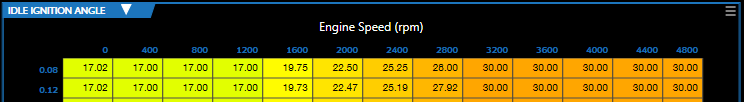

# RENUMBERING TABLE AXES

If a table axis has a name displayed, it may be possible to adjust the numerical values along the table axis.

>**NOTE:** Changing the axis values does not update the data in the body of the table. Once you are finished adjusting the axis values, you will need to update the cell data to be appropriate.

## Changing the Label of an Individual Row or Column

To change the value of the label for an individual row or column:

1. Click the name of the axis that you wish to adjust. The axis editor window appears.

2. 	Click the value that you wish to change.

3. 	Enter the new value.
>**NOTE:** If you are not changing one of the endpoints, the new value entered should fall between the values on either side of it.

4. To apply your changes, click the save button.

## Expanding or Contracting the Range of the Table

If you need to expand or contract the range of values on a table axis, you can do this by adjusting the axis endpoint values.
> **NOTE:** On some tables, the ECU will limit how far the range of the axes can be expanded. You cannot use this function to change an endpoint beyond the maximum or minimum value supported by the ECU.

1. Click the name of the axis that you wish to adjust. The axis editor window appears.

2. In the row of numbers above the graph, click either the value on the far left or the value on the far right (depending on which endpoint you wish to move).

3. Enter the new endpoint value.

4. Click the  icon in the toolbar. This will adjust the axis values in the middle to be evenly spaced between the new endpoint values.

5. To apply your changes, click the save button.

<a href="#" class="top-button" title="Return to top">↑</a>