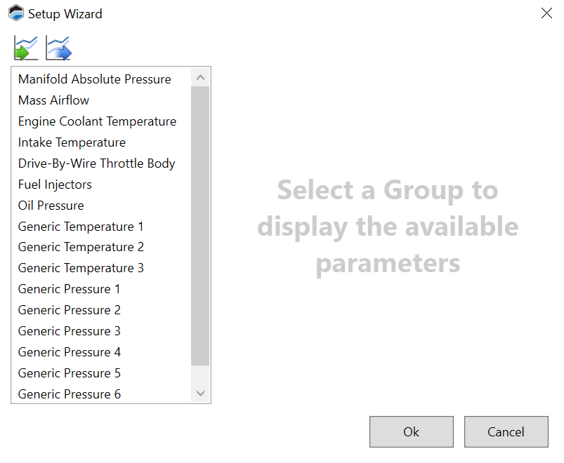
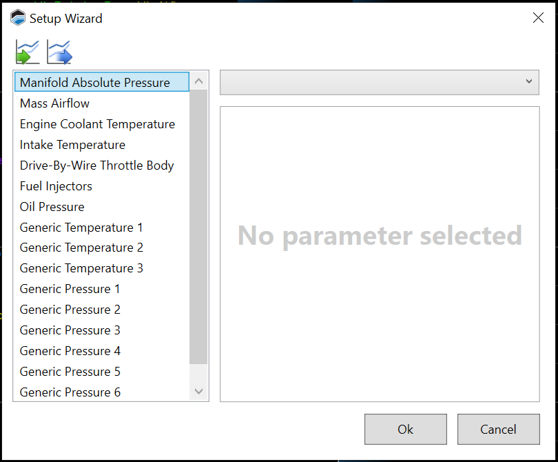

# RUNNING THE SETUP WIZARD

The Setup Wizard can quickly configure many of the ECU's parameters based on the hardware actually being used in the vehicle (specific sensor types, etc.).

>**NOTE:**
>These parameters can also be individually adjusted if your layout includes a configuration interface for them. The wizard simply provides a quick and easy way to configure multiple parameters to the recommended defaults for your hardware.

Follow these steps to run the wizard:

1. In the menu bar, select Tune > Setup Wizard. The Setup Wizard window appears

2. In the column on the left, select a group of settings you wish to configure

3. Use the dropdown in the top-right of the wizard window to select the hardware installed in the vehicle. The wizard will list the parameters that it will configure for you

    >**NOTE:**
    >For full descriptions of these parameters (and others), see the [Parameter Guide](https://files.hptuners.com/help/CoreParameterGuide.pdf)

4. Repeat steps 2 and 3 for each additional group you want the wizard to configure

5. When your are finished with the groups you want to configure, click **Ok**

6. If live tuning is enabled, VCM Live will send these updates to the ECU immediately. If live tuning is NOT enabled, click   to write the updated tune to the vehicle

7. If you need to import a predefined template into the setup wizard, click  and select the parameter you want to include into the setup wizard and click **Open**

    >**NOTE:**
    >File format for import and export is .SWT (Setup Wizard Template)

8. If you need to export the current template of the setup wizard, click  select the parameter you want to remove and click **Save**

<a href="#" class="top-button" title="Return to top">↑</a>