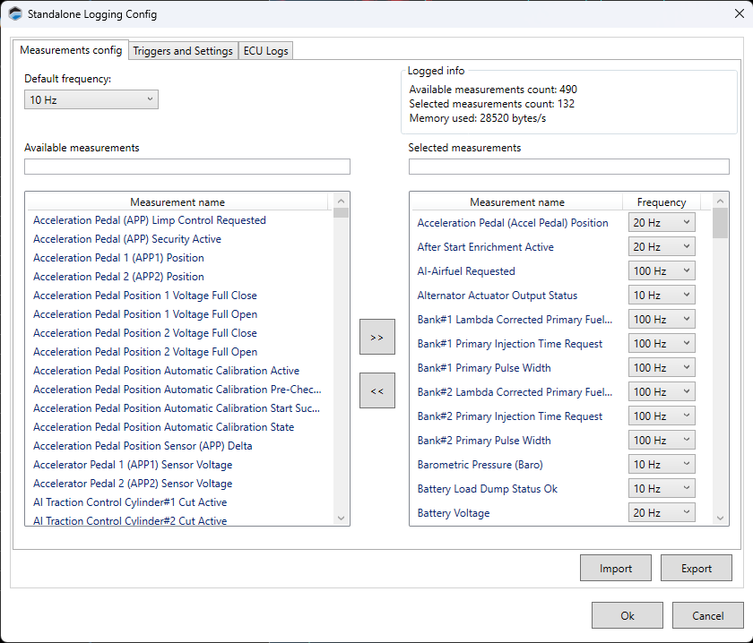

# STANDALONE LOGGING CONFIGURATION

Standalone Logging lets you log data directly to internal storage of your of the ECU without being tethered to a laptop. The data can then be retrieved when VCM Live is once again connected to the ECU.
>**NOTE:** Unlike the "Standalone Data Logging" feature in VCM Scanner, this feature does not require an HP Tuners interface device. Instead, it uses functionality built into the Core series of ECUs.

The process is as follows:

1. Select the measurements to be logged.

2. Define the triggers that will start and stop recording.

3. Write the configuration to the ECU.

4. Disconnect your laptop from the ECU and operate the vehicle in a manner which will set off the triggers defined in step 2.

5. Reconnect to VCM Live and retrieve the recorded data.

## Selecting The Measurements To Be Logged

1. In the menu bar, select ECU > Standalone Logging Config. The Standalone Logging Config Window appears.

>**NOTE:** All Standalone Data Logging Config files will be stored within the tune file.

2. Use the Default Frequency box to specify how many times per second the majority of measurements should be recorded.
>**NOTE:** The higher the frequency, the faster the ECU's available memory will be consumed by the recording. A good strategy is to choose a relatively low default frequency. Then, choose higher frequencies for individual measurements that require better resolution.

3. Select the measurements you wish to record. For each measurement you wish to add:
  
    a. In the column on the left side of the window, select a measurement.
    >**NOTE:** You can quickly search for a particular measurement by typing its name in the box above the list

    b. Click >> to move the selected measurement to the column on the right.

    c. If you want to record this measurement at a higher or lower rate than you specified as the default in step 3, use the **Frequency** dropdown next to the measurement to change the rate.
    >**NOTE:** At any point in the process, you can save your work to file by clicking the **Save** button. This feature also makes it possible to maintain multiple logging configurations that can be quickly swapped out simply by loading the desired configuration and writing it to the ECU.

## Defining Triggers and Other Settings

The triggers to start and stop recording are configured on the Triggers and Settings tab of the Standalone Logging Config page.

## IO On

If you want to use a button or switch to trigger recording, select the ECU input that is connected to the switch you want to use. Recording will begin when the switch is ON.

If you don't want to use a switch as a trigger leave this blank.
>**NOTE:** When this is used as a trigger, the next three fields will typically be set to zero, making the switch the only trigger. However, it CAN be used in conjunction with the other triggers.

## RPM Above (RPM)

The minimum engine RPM to begin required to begin recording.
>**NOTE:** RPM, TPS reading, and vehicle speed must all be above the thresholds specified on this page in order to begin recording. If you have an input selected for IO On, that switch must be in the ON position as well.

## TPS Above (%)

The minimum reading of the throttle position sensor (%) required to begin recording.

## Vehicle Speed (MPH)

The minimum vehicle speed required to begin recording.

## Off Delay (S)

Recording will stop when one or more of the triggers fall below the values specified above for at least this amount of time (in seconds).

## Max File Size (MB)

The maximum allowable size for each log file. When this limit is reached, the ECU will open a new file and continue recording.

## Roll Over

This box specifies what the ECU does when its memory is full.

- If this box IS NOT checked, recording will stop.

- If this box IS checked, the ECU will delete its oldest log file in order to continue recording.

## Retrieving Standalone Logs

1. On the ECU Logs tab of the Standalone Logging Config window, click the **Get Files** button. This will retrieve the list of log files currently stored on the ECU.

2. If you want to rename a log file before saving it to your laptop, select the file and then click **Rename**.

3. 	Save the log files you want by doing one of the following:

      a. Select the files you wish to save and then click **Save Selected**.

      b. Save all files by clicking **Save All**.

4. If desired, you can free memory on the ECU by deleting the log files stored there. Do one of the following:

      a. Select the files you wish to delete and then click **Erase Selected**.

      b. Delete all files by clicking **Erase All**.

<a href="#" class="top-button" title="Return to top">↑</a>