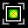

# THE TABLE EDITOR TOOLBAR

The toolbar in Table Editor has many options for viewing and modifying tables.

## Select View

| Icon | Description |
| ----------- | ----------- |
|  | Selects the 3D graph view. In split view mode, this changes between 2D, 3D and histogram view.|
|  | Selects the 2D graph view. In split view mode, this changes between 2D, 3D and histogram view. |
|  | Selects the histogram view. In split view mode, this changes between 2D, 3D and histogram view.
|  | Selects the table view. In split view mode, the table is always one of the views in the split.|

## Single View v.s. Split View

| Icon | Description |
| ----------- | ----------- |
|  | View only one data representation (table, 2D/3D graph or histogram).|
|  | Use a vertical split with the table display on the left and the graph or histogram on the right. |
|  | Use a horizontal split with the table display on top and the graph or histogram on the bottom. |

## Precision

| Icon | Description |
| ----------- | ----------- |
|  | Increase decimal precision (add a decimal place).|
|  | Decrease decimal precision (remove a decimal place).|

## Modify

| Icon | Description |
| ----------- | ----------- |
|  | Replace selected cells with the value in the box.|
|  | Add the value in the box to the selected cells. |
|  | Multiply the selected cells by the value in the box. |

## Smoothing and Interpolation

| Icon | Description |
| ----------- | ----------- |
|  | Smooth the entire selection.|
|  | Smooth the selection only using a horizontal pass. |
|  | Smooth the selection only using a vertical pass.  **NOTE:** When using the smoothing functions, the level of smoothing will be determined by your current precision. To increase the effected area of your smoothing, increase your precision
|  | Interpolate the entire selection (flat plane).|
|  | Interpolate between horizontal bounds (creates lines). |
|  | Interpolate between vertical bounds (creates lines). |

<a href="#" class="top-button" title="Return to top">↑</a>