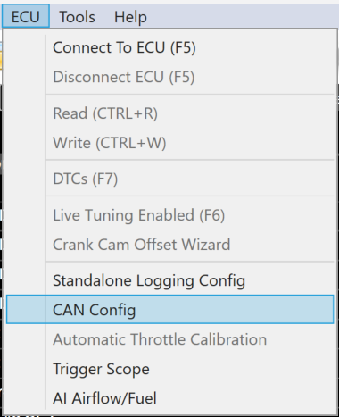
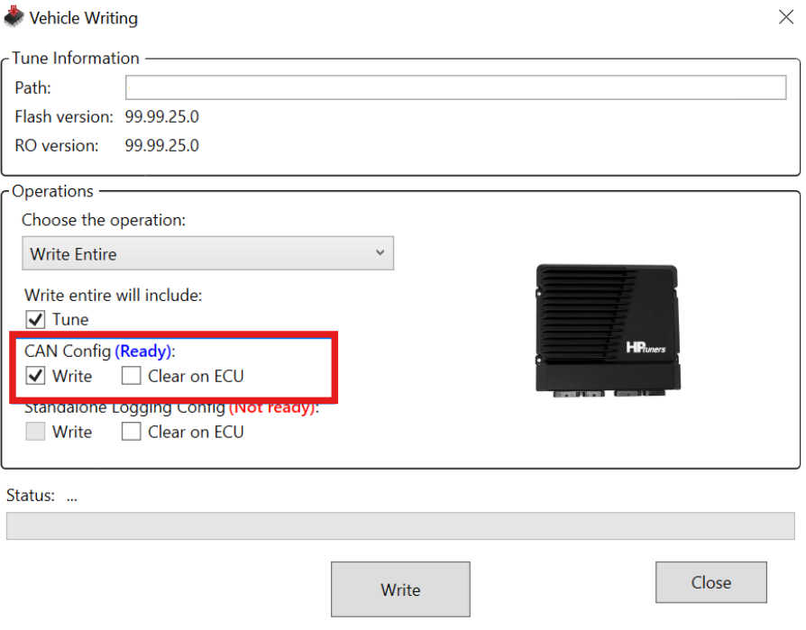
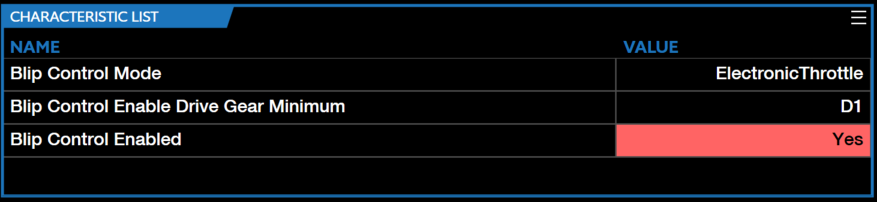
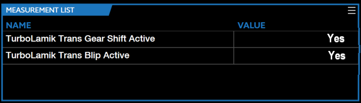
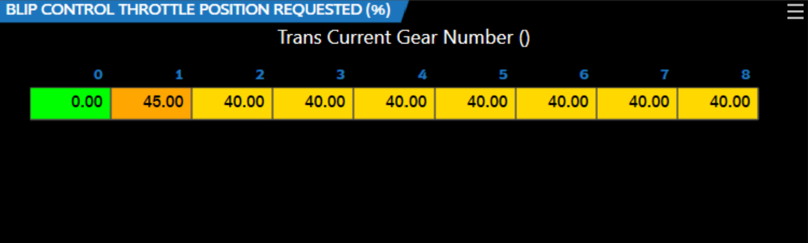
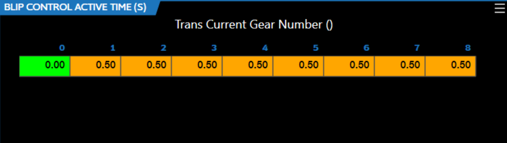
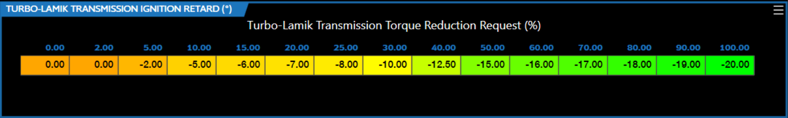

# THIRD PARTY CONTROLLERS

This section outlines any third party controllers that can be used parallel to CORE and VCM Live. The list below outlines all available controllers:

- TurboLamik TCM

## TurboLamik Setup Procedures

The below step-based procedure outlines how to setup a TurboLamik TCU (Transmission Control Unit) with HP Tuners CORE ECU (Engine Control Unit) using VCM Live in two different procedures (CAN Configuration Setup and VCM Live Setup). If you are looking for instructions on how to install a TurboLamik TCU, please refer to the [TurboLamik Manual](https://www.turbolamik.us/resources/)

### CAN Configuration Setup Procedure

1. Download the latest VCM Live Beta ([download here](https://www.hptuners.com/downloads/)).

2. Open VCM Live.

3. Click the  icon to connect to CORE.
>**NOTE:** CORE communicates via CAN so setting up requires connecting the TurboLamik to one of the designated CAN ports, with the matching bitrate on the TurboLamik side.

4. In the menu bar click **ECU** > **CAN Config**.

    

5. In the CAN Config window select the CAN port that is physically connected to the TurboLamik TCU (CAN 1 or CAN 2) and ensure the bitrate matches the bitrate on the TurboLamik TCU.

6. Click **Predefined** > **Turbolamik**.

    !!! Caution
        These are grouped messages, if one gets deleted the entire group of messages will be deleted.

7. Click **Ok**.

8. Click  icon to write the CAN config changes to CORE.
>**NOTE**: Ensure "**CAN Config (Ready):**" Write check box is checked off (refer to image below).

    

9. Click **Write**.

10. TurboLamik Can Configuration is now complete, refer to **TurboLamik VCM Live Setup Procedure** below to setup all TurboLamik associated Parameters.

### TurboLamik VCM Live Setup Procedure

1. Open VCM Live (if not already opened).

2. In the menu bar click **Layout** > **Import Layout** > **From Additional** > **TurboLamik**.

3. Click **Tune** > **Open Tune** and select the latest Tune file.

4. Ensure to change the characteristic **Transmission Type** parameter to the **ZF8TurboLamikTransmission** value.

5. Enable Blip Control, by selecting the below values for all of the below characteristics.

>**NOTE**: CORE Blip Control allows users to set a defined throttle position during transmission downshifts. This feature is exclusively applicable to the ZF8 transmission.

6. Activate all of the below characteristics with the below values.

7. Tune blip behavior with the below characteristics.

    a. **"BLIP CONTROL THROTTLE POSITION REQUESTED (%)"**
    >**NOTE**: This table defines the throttle position during a blip.

    

    b. **"BLIP CONTROL ACTIVE TIME (S)"**

    

8. Utilize the **"TURBO-LAMIK TRANSMISSION IGNITION RETARD (°)"** characteristic to retard the ignition angle (spark) to enable smooth transmission shifts.
>**NOTE**: TurboLamik provides the torque reduction (%) to CORE, which then uses this input to retard the ignition timing based on the below table.

    

9. TurboLamik is now ready to be utilized.

<a href="#" class="top-button" title="Return to top">↑</a>