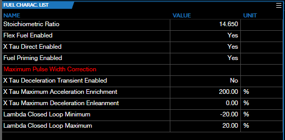
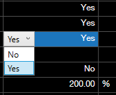

# TUNING LIST CHARACTERISTICS

A characteristic list has three columns: Name, Value and Unit.

> **NOTE:** Characteristics whose names appear in red are in your current layout, but are not included in the current tune.

To change the value of a characteristic in the list:

1. 	Double-click near the left end of the Value column. Some characteristics will display a drop down list of options. Others will simply allow you to type a new value.

    &nbsp;&nbsp;&nbsp;&nbsp;&nbsp;&nbsp;&nbsp;&nbsp;&nbsp;&nbsp;&nbsp;&nbsp;&nbsp;&nbsp;&nbsp;  

2. Select or enter the new value.

> **NOTE:** The background color will change to indicate that the field's value has been modified since the last time the tune file was saved. If the new value is higher, the background will be pink & red. If lower, the color will be light purple & dark purple.

