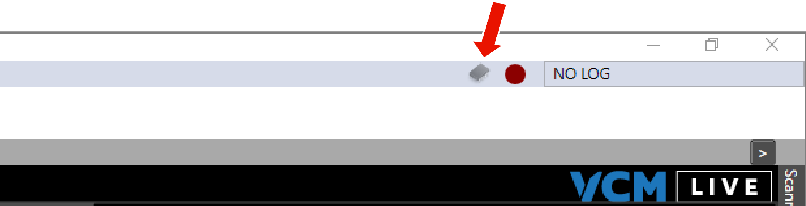
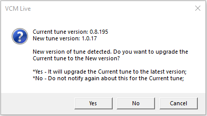
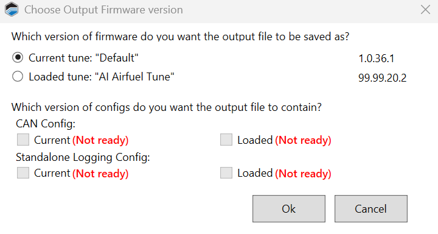

# UPGRADING AND COMPARING TUNES

The Upgrade Tune tool has two functions:

- If the tune file that you have open has an older file format than the default tunes for your current version of  VCM Live, you can upgrade it to the current file format. This allows you to include all the newest parameters supported by the ECU.

- Compare the tune that is currently open in VCM Live with a saved tune file and then import some or all of the file's parameter values.

## Quick File Version Upgrade

When the open tune's file version is out of date, the New File Version icon appears near the upper-right corner of the VCM Live window.

To perform a quick upgrade to the latest file version, click this icon. You will be prompted to confirm the upgrade.

## Using the Upgrade Tune Tool

1. Select **Tune** > **Upgrade Tune** in the menu bar. If the tune's file format is out of date, a prompt like the one below is displayed.

    a. Select **Yes** if you simply want to upgrade your tune to the latest file version. You will be prompted for a name for the upgraded file. Once the name is entered, the tool saves the upgraded file and exits. It does not proceed to step 2.
    >**NOTE:** This process is the same as the upgrade that you are offered when you click the New File Version icon.

    b. If you selected **No**, the file selection dialog will open. Choose the file you wish to compare your current tune to and then click **Open**. Proceed to Step 2.

2. If the new file has a different version, a prompt like the following will be displayed.

    a. Select the file version you want to use and then click **Ok**.

3. Once you have responded to all the prompts, the Upgrade Tune window appears.

    a. The values in the current tune are displayed in the upper-left panel.

    b. The values in the file you just opened are displayed in the lower-left panel.

    c. The names of parameters that have been added or removed or whose values have changed will be highlighted.

4. Select a highlighted parameter. Its values will appear on the right:

    a. The current value of this parameter is displayed in the upper-right panel.

    b. The value in the newly-opened file is displayed in the middle-right panel.

5. Indicate which of these values you want to keep:

    a. To keep the current value, click **Use Current Tune Values**. This is the default for all parameters.

    b. To import the value from the new file, click **Use Loaded tune Values**.

    c. To enter a custom value, click on the value displayed in the lower-right panel and then enter the desired value.

6. Repeat steps 4 to 5 for all parameters that you wish to modify or import from the new file.

7. Click **Save Changes**.

<a href="#" class="top-button" title="Return to top">↑</a>