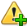

# USER ALERTS

It's possible to set up visual alerts when particular measurements reach specified values. Follow these steps

1. In the menu bar, select **Tools** > **User Alerts**. The User Alert Window appears. If you have not yet defined any alerts, the list of alerts here is will be empty.

    

2. Click  icon. A new row appears in the table below.
3. In the new row, select the measurement whose value will trigger the alert:

    a. Double-click the **MEAS NAME** box in the new row. A list of available measurements appears.

    

    b. 	Double-click on the measurement you want to use for this alert. A prompt appears, asking you to select the unit for this measurement.

    

    c. Select the desired unit.

    d. click **Ok**.

4. The Operator and Operand fields are used to compare the measurement to a specified value. The alert will be triggered when this comparison is true.

    - **Operator** - The operator (>, =, <, etc.) to use when comparing this measurement to the value specified in the **Operand** column.
    - **Operand** - The value to compare the specified measurement to.

5. In the **Alert Name** column, enter the name that you want to use to refer to this alert.
6. Repeat steps 2 to 5 or each additional alert you wish to add.
7. Click **Save**.

<a href="#" class="top-button" title="Return to top">↑</a>