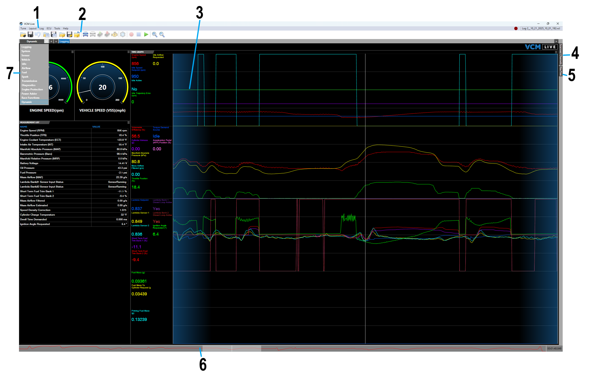

# USER INTERFACE

| Item | Description |
| ----------- | ----------- |
| 1. | **Menu Bar** - See [Menu Bar](Menu Bar.md) for description of individual menus.|
| 2. | **Toolbar** - See the [Main Toolbar](Main Toolbar.md) descriptions of individual items. |
| 3. | **Data Display & Editing Subwindows** - This area contains two types of subwindow: measurement and characteristic   - When recording from a connected ECU, measurement subwindows display live data gathered from the ECU. When viewing a log file, they display the logged data.   - Characteristic subwindows provide interfaces for configuring the ECUs tunable parameters.  This area is highly configurable. It can be set up to display the configuration and data display subwindows that are most appropriate for the task at hand. See [Layouts](Layouts.md) for more information.
| 4. | **Scanned Channels Tab** - Select this tab to see the list of all the channels being actively monitored by VCM Live. Channels are automatically monitored when you include a gauge, graph or list that uses the corresponding measurement in your layout.|
| 5. | **NavTree Tab** - Select this tab to display the full list of the ECU's parameters (both measurements and characteristics). This allows users to browse or search for desired parameters. |
| 6. | **Timeline** - When playing back a log file, the slider on this timeline indicates the moment you are currently viewing. Slide right or left to jump forward or back in the recorded log data. See [The Timeline](The Timeline.md).|
| 7. | **Grouping of Layout** - This tab groups fourteen different layouts:   - **Logging** - This layout facilitates the logging of predefined, basic, and essential parameters.   - **System** - This layout will help with engine configuration   - **Sensor** - This layout allows users to configure all applicable sensors   - **Vehicle** - This layout allows users to configure basic vehicle controls   - **Idle** - This layout allows users to configure all idle related parameters while using the Drive-By-Cable   - **Airflow** - This layout allows users to configure all airflow related parameters   - **Fuel** - This layout allows users to configure all fuel control related parameters   - **Spark** - This layout allows users to configure all spark options   - **Transmission** - This layout allows users to configure transmission related parameters   - **Diagnostics** - This layout allows users to control all related MIL and DTC related parameters   - **Engine Protection** - This layout allows users to configure all engine protection parameters   - **Power Adder** - This layout allows users to configure all boost and nitrous power adding related parameters   - **Race Functions** - This layout allows users to monitor all race function parameters in one easy convenient layout   - **Dynamic** - This layout allows users to create their own specific layout. This layout is the only layout you can customize|

<a href="#" class="top-button" title="Return to top">↑</a>