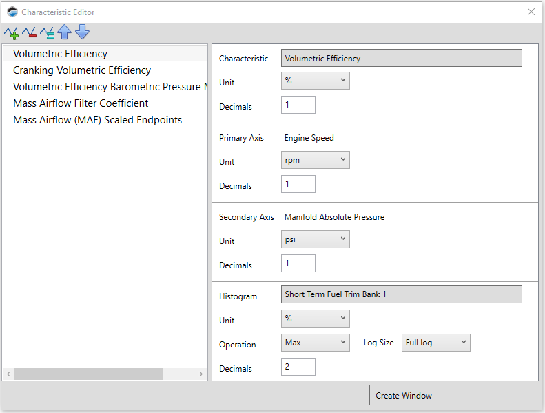
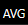

# USING HISTOGRAM VIEW

Histogram view plots the output over time of a measurement that has been associated with the base table. This can be useful for:

- Gathering sample data to use in the table based on the actual behavior of the vehicle.

- Seeing what might need to be adjusted in a table based on the real time corrections being made by the ECU. (For example: observing short term fuel trims can tell you how much you might need to tweak the fuel/air mix.)

For histogram data to be displayed, the appropriate histogram setup must be completed for the base table. See *Histogram Setup* (below) for details.

Once setup is completed, a histogram will be displayed only if one of the following is true:

- You are viewing a log file.

- You are connected to the ECU and have been recording data. (The histogram will appear when you stop recording).

## Histrogram Setup

In order to use histogram view, the histogram must be setup when the table is added to your layout. Alternately, the histogram can be configured later by doing the following:

1. Click the icon in the upper-right corner of the subwindow containing the table to which you want to add a histogram. A menu appears.

2. Select Edit Subwindow. The Characteristic Editor window appears.

3. In the left column, select the table to which you want to add a histogram.

4. In the right column, fill out the fields in the bottom section:

    a. Click the **Histogram** field.

    b. 	Select a measurement that will supply the histogram data.

    >**NOTE:** The best measurements to select will typically contain an ECU-calculated correction for the base table. For example, short term fuel trims are good histograms to use with Volumetric Efficiency tables.

    c. Fill out the remaining fields in the bottom section as desired. These fields merely specify the default settings for the histogram view.

    d. Click **Create Window**.

>**NOTE:** See [Adding a Table Editor](Adding a Table Editor.md) for more information on setting up tables and their associated histograms.

## Histogram Controls

When a histogram view is selected, the following additional icons appear on the right end of the table editor toolbar:

The extra icons are divided into two groups: **Cell Data Selection** and **Time Range Selection**.

### Cell Data Selection
>**NOTE:** These icons select the type of data displayed in the cells.

| Icon | Description |
| ----------- | ----------- |
|  | Show the highest value observed for each cell.|
|  | Show the lowest value observed for each cell. |
|  | Show the average of all observed values for each cell. (This is the most commonly-used option.) |
|  | Show the hit count for each cell.|

### Time Range Selection
>**NOTE:** These icons select the time range for which data is graphed.

| Icon | Description |
| ----------- | ----------- |
|  | Show data from entire length of the recording.|
|  | Show only the data gathered during the time frame indicated by the timeline slider bar.|

## Using Histogram Data to Adjust the Main Table

You can copy the collected performance data from histogram panel to the base table. Follow these steps:

1. (Recommended) Select the left/right split table view icon and then the histogram icon. This allows you to view the base table and the histogram side-by-side.

     + 

2. 	In the histogram, select the cells whose data you wish to copy.

3. 	Right-click on the selected cells and select Copy.

4. 	Right-click on the body of the base table and select Paste Special. A submenu with paste options appears.

    

5. 	Select a submenu option. This indicates how the histogram data should be applied to the base table data.

<a href="#" class="top-button" title="Return to top">↑</a>