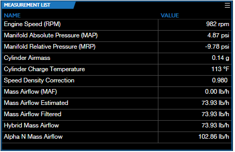

# USING MEASUREMENT LIST SUBWINDOW

Measurement list subwindows contain simple lists of ECU measurements with two columns: Name and Value.

When actively recording a connected ECU or playing back a log file, VCM Live updates the Value column in real time to reflect the live or recorded measurements.

## Changing The Display Properties for a Parameter

To modify the display properties for an individual parameter, right click on the parameter you wish to modify. A menu of configurable parameters appears:

- **Polling Interval** - Change the polling interval for the measurement.

- **Units** - Change the displayed units for the measurement.

- **Decimals** - Increase or decrease the number of decimal places displayed for the measurement.

## Modifying The Subwindow

To make changes to the entire subwindow, such as adding or removing measurements, renaming the subwindow, or resizing it, see [Subwindows](Subwindows.md)